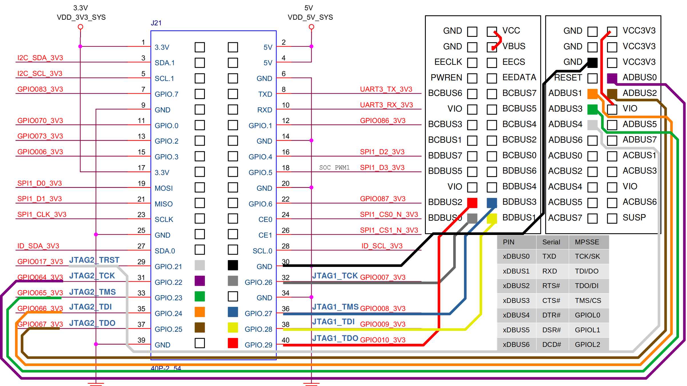

# EIC770x Documentation Collection

## JTAG on Hifive Premier P550:
- JTAG_MCU: MCU (STM32)
- JTAG0: MCPU (4x P550 cluster) + LPCPU (1x E21) + NPU (10x E21)
- JTAG1: SCPU (1x E21)
- JTAG2: DSP (4x Tensilica Vision Q7?)

## JTAG connections on Hifive Premier P550:
- JTAG_MCU: FT4232 Channel B
- JTAG0: FT4232 Channel A
- JTAG1: GPIO 40pin
- JTAG2: GPIO 40pin

## External Connection of JTAG1/2

