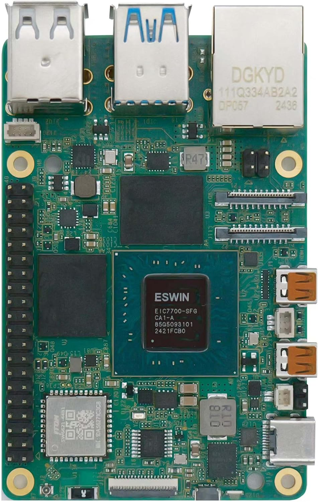
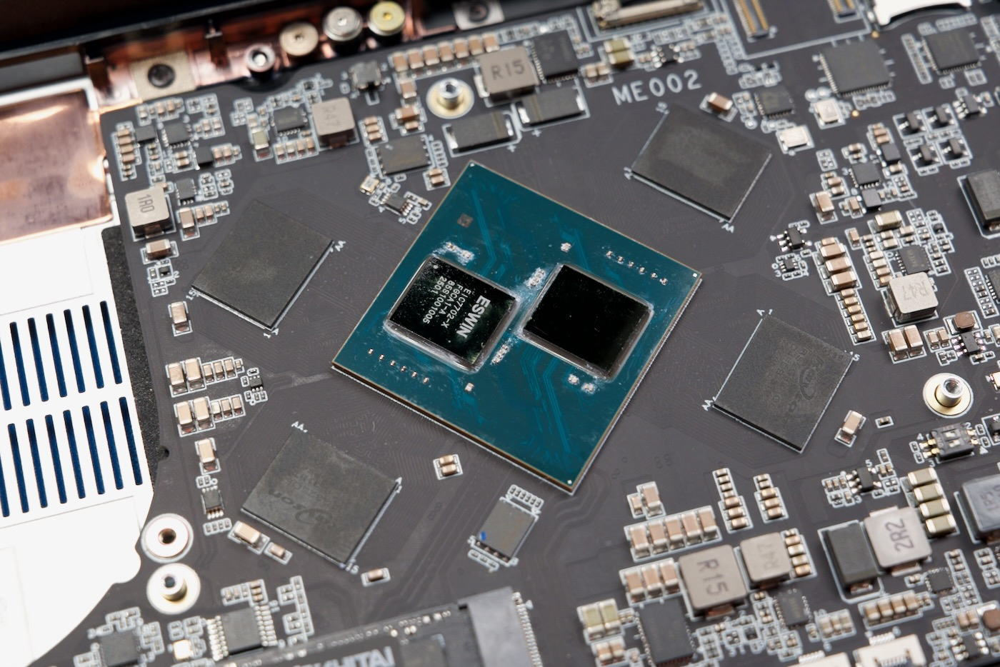
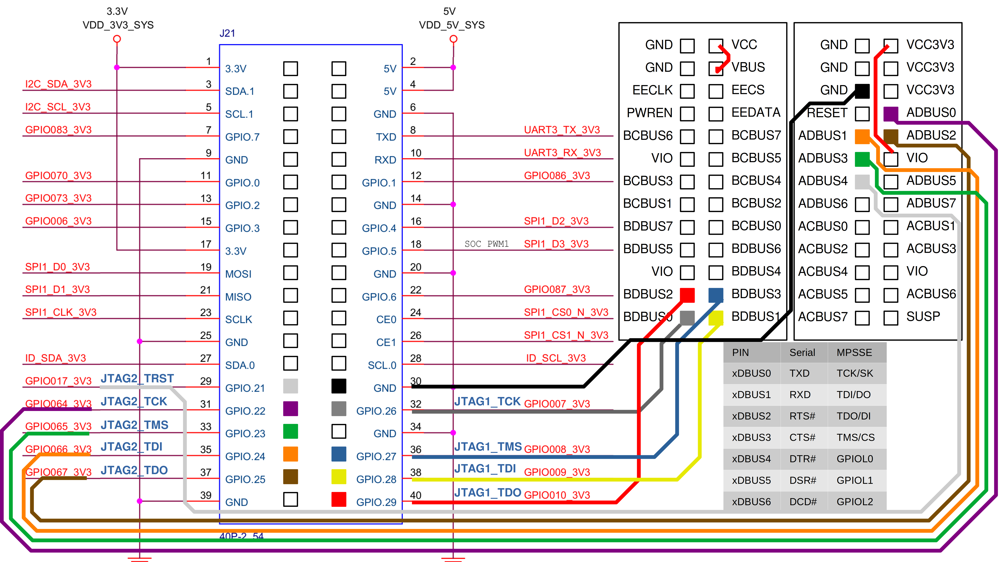

# EIC770x Documentation Collection

## What is EIC770x?
EIC770x stands for ESWIN's [EIC7700](https://www.eswincomputing.com/bocupload/2024/06/07/171773119629660z9pt.pdf) and [EIC7702](https://www.eswincomputing.com/bocupload/2024/06/07/171773121542019z1u1.pdf) SoC. EIC7700 is the single DIE version, whereas the EIC7702 is essentially 2 identical EIC7700 DIEs on the same substrate.

 

For EIC7702, you get double the cores and peripherals of EIC7700, mapped interleaved. You also get 2 PLIC interrupt controllers, each responsible for its own DIE. It's a pretty straightforward design. The peripherals in the datasheet for EIC7700 can seamlessly apply for EIC7702, except their base addresses are offsetted differently in DIE 0 and DIE 1 (from RISCV cores POV).

The part that's missing is the DIE-to-DIE Serdes, "D2D" mentioned in some ESWIN Docs, which ESWIN hasn't made public yet. It's responsible for all cross DIE communications. You can check out some [RE done by Stefan Holst](https://github.com/s-holst/fml13v03-notes/tree/main/firmware#bootspi---d2d) regarding D2D. If you plan to get an EIC770x chip for experiments, I'd recommend using the single-DIE version. The D2D injects significant amount of latency (My [analysis](https://github.com/geerlingguy/sbc-reviews/issues/82#issuecomment-3565169651)), and very temperature sensitive. You might run into some stability issues with the dual-DIE EIC7702.

## New!! EIC7700 Firmware Hacking Guide
- [README](./board/bootchain/README.md)

## New!! EIC7702/fml13v03 (DC ROMA II) Reverse Engineering by Stefan Holst
- [Notes](https://github.com/s-holst/fml13v03-notes/blob/main/firmware/README.md)

## SoC Docs
- [Part1](./soc/EIC7700X_SoC_Technical_Reference_Manual_Part1.pdf) (Core and basic peripherals clock/reset/pinctrl/SMMU/MBOX/WDT/RTC/PVT)
- [Part2](./soc/EIC7700X_SoC_Technical_Reference_Manual_Part2.pdf) (LPDDR/EMMC/SDIO/SATA/Video Processing)
- [Part3](./soc/EIC7700X_SoC_Technical_Reference_Manual_Part3.pdf) (Video In/Out)
- [Part4](./soc/EIC7700X_SoC_Technical_Reference_Manual_Part4.pdf) (PCIe/GMAC/USB/UART/I2C/I2S/SPI/GPIO/PWM)
- [Combined](./soc/EIC7700XSOC_Manual_V1p1_20250114.pdf) (All combined, but lacking some details compared to the previous ones)

## Memory map in detail
- [P550 Core](./soc/memory-map-p550.md)
- [SoC](./soc/memory-map-soc.md)

## Masked ROM Dump
- See [rom/](./rom/) directory

## Synopsys Docs
- EIC770x integrates at least 3 crypto IPs from Synopsys
- Security Protocol Accelerator (SPAcc) mapped at `0x51900000` (also `0x21900000` for SCPU)
- Public Key Accelerator (PKA) mapped at `0x51b00000` (also `0x21b00000` for SCPU)
- True Random Number Generator (TRNG) mapped at `0x51b08000` (also `0x21b08000` for SCPU)
- Datasheets are available on the internet

---
# Board, BMC and UART converters

## HiFive Premier P550 Schematics
- [SOM Schematic](./board/HiFivePremierP550CarrierBoardSchematicv3.0.pdf)
- [Board Schematic](./board/HiFivePremierP550SOMSchematicv3.0.pdf)

## FTDI Docs
- [FT4232 Datasheet](./ftdi/DS_FT4232H.pdf) (Used by onboard JTAG/UART to USB)
- [FT2232 Datasheet](./ftdi/DS_FT2232H.pdf) (Used by external JTAG to SCPU/DSP)
- [FT2232 Mini Module](./ftdi/DS_FT2232H_Mini_Module.pdf) (Used by external JTAG to SCPU/DSP)

## STM32 Docs
- Refer to the [stm32](./stm32) directory for datasheets/manuals
- P550 uses STM32F407VET6 as BMC

## JTAG
### JTAG chain on Hifive Premier P550:
- JTAG_MCU: MCU (STM32)
- JTAG0: MCPU (4x P550 cluster) + LPCPU (1x E21) + NPU (10x E21)
- JTAG1: SCPU (1x E21)
- JTAG2: DSP (4x Tensilica Vision Q7?)

### JTAG connections on Hifive Premier P550:
- JTAG_MCU: FT4232 Channel B (FT4232 is onboard)
- JTAG0: FT4232 Channel A    (FT4232 is onboard)
- JTAG1: GPIO 40pin
- JTAG2: GPIO 40pin

### Patch to Linux device-tree to retain pin mux for live Linux Kernel debugging:
**Basically remove pinctrl_gpio7/8/9/10/17/64/65/66_default**
**If not done, openocd will disconnect once pinctrl driver kicks in**
```
diff --git a/arch/riscv/boot/dts/eswin/eic7700-hifive-premier-p550.dts b/arch/riscv/boot/dts/eswin/eic7700-hifive-premier-p550.dts
index 1c542a9e3c74..44735f82dd4c 100644
--- a/arch/riscv/boot/dts/eswin/eic7700-hifive-premier-p550.dts
+++ b/arch/riscv/boot/dts/eswin/eic7700-hifive-premier-p550.dts
@@ -710,11 +710,11 @@ &timer3 {
 &pinctrl {
 	status = "okay";
 	pinctrl-names = "default";
-	pinctrl-0 = <&pinctrl_gpio6_default &pinctrl_gpio7_default &pinctrl_gpio8_default &pinctrl_gpio9_default
-			&pinctrl_gpio10_default &pinctrl_gpio17_default &pinctrl_gpio35_default &pinctrl_gpio36_default
+	pinctrl-0 = <&pinctrl_gpio6_default
+			&pinctrl_gpio35_default &pinctrl_gpio36_default
 			&pinctrl_gpio37_default &pinctrl_gpio38_default &pinctrl_gpio39_default &pinctrl_gpio40_default
 			&pinctrl_gpio41_default &pinctrl_gpio46_default &pinctrl_gpio52_default
-			&pinctrl_gpio53_default &pinctrl_gpio64_default &pinctrl_gpio65_default &pinctrl_gpio66_default
+			&pinctrl_gpio53_default
 			&pinctrl_gpio67_default &pinctrl_gpio70_default &pinctrl_gpio73_default &pinctrl_gpio83_default
 			&pinctrl_gpio86_default &pinctrl_gpio87_default &pinctrl_gpio92_default &pinctrl_gpio93_default>;
```

## OpenOCD configuration

### JTAG0:
- [openocd_mcpu.cfg](./p550/jtag/openocd_mcpu.cfg)
- OpenOCD sample output
```
Open On-Chip Debugger 0.12.0-dirty (2024-08-21-02:49)
Licensed under GNU GPL v2
For bug reports, read
	http://openocd.org/doc/doxygen/bugs.html
Info : clock speed 5000 kHz
Info : JTAG tap: riscv.cpu tap/device found: 0x00000913 (mfg: 0x489 (SiFive Inc), part: 0x0000, ver: 0x0)
Info : datacount=2 progbufsize=16
Info : Disabling abstract command reads from CSRs.
Info : Core 0 made part of halt group 1.
Info : Examined RISC-V core; found 4 harts
Info :  hart 0: XLEN=64, misa=0x80000000009411ad
Info : datacount=2 progbufsize=16
Info : Disabling abstract command reads from CSRs.
Info : Core 1 made part of halt group 1.
Info : Examined RISC-V core; found 4 harts
Info :  hart 1: XLEN=64, misa=0x80000000009411ad
Info : datacount=2 progbufsize=16
Info : Disabling abstract command reads from CSRs.
Info : Core 2 made part of halt group 1.
Info : Examined RISC-V core; found 4 harts
Info :  hart 2: XLEN=64, misa=0x80000000009411ad
Info : datacount=2 progbufsize=16
Info : Disabling abstract command reads from CSRs.
Info : Core 3 made part of halt group 1.
Info : Examined RISC-V core; found 4 harts
Info :  hart 3: XLEN=64, misa=0x80000000009411ad
Info : starting gdb server for riscv.cpu0 on 3333
Info : Listening on port 3333 for gdb connections
Info : Listening on port 6666 for tcl connections
Info : Listening on port 4444 for telnet connections
```
## For Expert Users debugging SCPU/DSP through JTAG1/2
### External Connection of JTAG1/2

- Above is the diagram connecting FT2232H Mini Module
- Ensure VCC <-> VBUS is bridged
- Ensure VCC3V3 <-> VIO is bridged
- JTAG1 has no reset pin
- JTAG2 has TRST

### JTAG1
- [openocd_scpu.cfg](./board/jtag/openocd_scpu.cfg)
- OpenOCD sample output
```
Open On-Chip Debugger 0.12.0-dirty (2024-08-21-02:49)
Licensed under GNU GPL v2
For bug reports, read
	http://openocd.org/doc/doxygen/bugs.html
Info : clock speed 5000 kHz
Info : JTAG tap: riscv.cpu tap/device found: 0x00002913 (mfg: 0x489 (SiFive Inc), part: 0x0002, ver: 0x0)
Info : datacount=1 progbufsize=16
Info : Disabling abstract command reads from CSRs.
Info : Examined RISC-V core; found 1 harts
Info :  hart 0: XLEN=32, misa=0x40901105
Info : starting gdb server for riscv.cpu on 3333
Info : Listening on port 3333 for gdb connections
Info : Listening on port 6666 for tcl connections
Info : Listening on port 4444 for telnet connections
```
### JTAG2:
- [openocd_dsp.cfg](./board/jtag/openocd_dsp.cfg)
- OpenOCD sample output
```
Open On-Chip Debugger 0.12.0-dirty (2024-08-21-02:49)
Licensed under GNU GPL v2
For bug reports, read
	http://openocd.org/doc/doxygen/bugs.html
Info : clock speed 5000 kHz
Info : JTAG tap: dsp3.cpu tap/device found: 0x20a73007 (mfg: 0x003 (Fairchild), part: 0x0a73, ver: 0x2)
Info : JTAG tap: dsp2.cpu tap/device found: 0x20a73005 (mfg: 0x002 (AMI), part: 0x0a73, ver: 0x2)
Info : JTAG tap: dsp1.cpu tap/device found: 0x20a73003 (mfg: 0x001 (AMD), part: 0x0a73, ver: 0x2)
Info : JTAG tap: dsp0.cpu tap/device found: 0x20a73001 (mfg: 0x000 (<invalid>), part: 0x0a73, ver: 0x2)
Warn : gdb services need one or more targets defined
Info : Listening on port 6666 for tcl connections
Info : Listening on port 4444 for telnet connections
```
